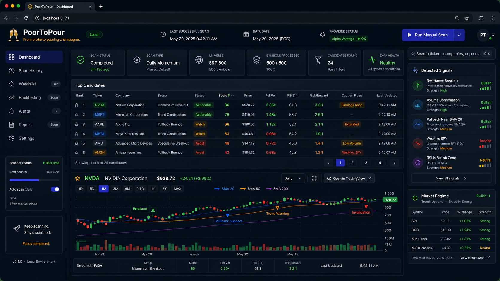
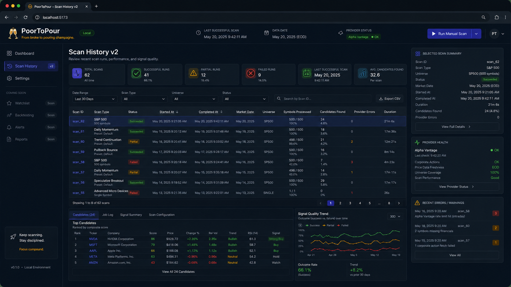
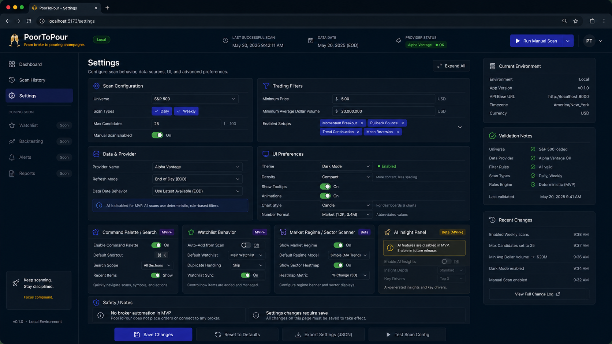
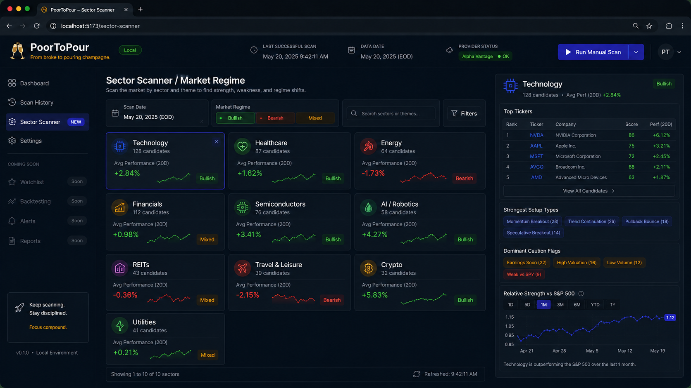
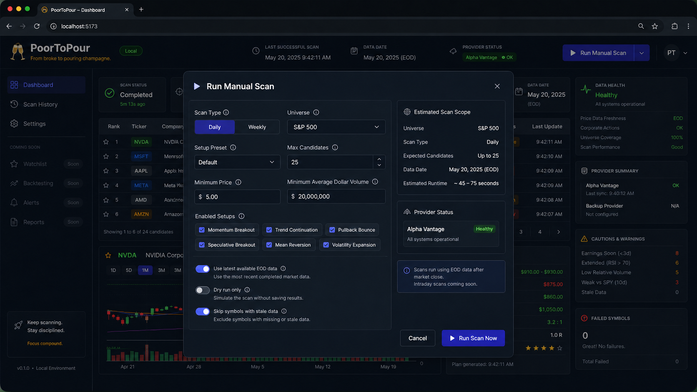

# PoorToPour 🥂📈

From broke to pouring champagne.

PoorToPour is a personal trading research dashboard for scanning U.S. equities, identifying explainable technical trade setups, and reviewing candidate trade ideas with chart evidence, score breakdowns, caution flags, and risk/reward context.

The long-term vision is to grow this into a controlled trading assistant, but the MVP is intentionally simple: a local-first, long-only swing-trade scanner for the S&P 500 using daily and weekly data.

## Current Status

**Phase:** Phase 1 — Data Foundation  
**MVP Direction:** Local-first research dashboard  
**Trading Scope:** Long-only, daily/weekly swing scans  
**Universe:** S&P 500 first  
**Execution:** Manual review only  
**Automation:** Not included in MVP

## MVP Scope

The MVP should allow the user to:

- load a defined U.S. stock universe;
- ingest daily OHLCV data;
- compute technical indicators;
- detect basic long-only setups;
- rank candidates;
- inspect chart evidence;
- review setup explanations;
- see caution flags and data freshness;
- view basic risk/reward estimates;
- review previous scan runs.

## Not MVP

PoorToPour does not include these in the MVP:

- live broker trading;
- automatic order placement;
- options trading;
- short-selling;
- intraday day-trading scans;
- AI-generated trade decisions;
- social-media/news firehose ingestion;
- multi-user SaaS features.

## First Setup Families

The first scanner focuses on:

1. Breakout
2. Pullback continuation
3. Relative strength leader

All strategy output should be deterministic, explainable, and suitable for future backtesting.

## Planned Stack

| Layer | Direction |
| --- | --- |
| Frontend | React + TypeScript |
| Backend | Python FastAPI |
| Database | PostgreSQL |
| Local runtime | Docker Compose |
| Scheduling | APScheduler first |
| Indicators | Internal `IndicatorService`, with open-source libraries where practical |
| Data | Tier 1 provider-backed data for MVP |

## Local Development

Phase 1 now includes a Docker Compose scaffold with a FastAPI backend, React/Vite frontend, PostgreSQL, and a fixture-backed mock provider.

Start the stack:

```powershell
docker compose up -d --build
```

Open:

- Frontend: http://localhost:5173
- Backend health: http://localhost:8000/api/health
- Latest mock scan: http://localhost:8000/api/scans/latest
- Persisted scan runs: http://localhost:8000/api/scans
- Persisted symbols: http://localhost:8000/api/symbols
- Persisted NVDA daily bars: http://localhost:8000/api/symbols/NVDA/bars
- AAPL indicator snapshot: http://localhost:8000/api/symbols/AAPL/indicators
- Database UI: http://localhost:8080

On backend startup, Docker runs:

```powershell
alembic upgrade head
python -m app.scripts.seed_mock_data
```

The seed command is idempotent and loads mock symbols, company profiles, earnings events, daily bars, and one persisted mock scan run into PostgreSQL.

To load the versioned S&P 500 universe seed:

```powershell
docker compose run --rm backend python -m app.scripts.seed_sp500_universe
```

The S&P 500 seed lives at `data/seeds/sp500_seed.csv`. Source notes and caveats are recorded in `data/seeds/sp500_seed_metadata.md`.

Database UI login:

```text
System: PostgreSQL
Server: db
Username: poortopour
Password: poortopour
Database: poortopour
```

To ingest a small real daily OHLCV sample through the yfinance bootstrap adapter:

```powershell
docker compose run --rm backend python -m app.scripts.ingest_yfinance_bars --symbols AAPL MSFT NVDA --period 3mo
```

This command is idempotent for each symbol/date and stores rows with `source = yfinance`. It is a Phase 1 bootstrap path, not the final trading-grade provider choice.

Indicator snapshots are calculated deterministically from persisted daily bars. The current snapshot includes SMA 20/50/200, EMA 21, 20-day average volume, relative volume, 52-week high, distance from the 52-week high, trend flags, and data sufficiency warnings.

Scan runs and candidates are persisted in `scan_runs` and `scan_candidates`. The existing latest-scan endpoint now prefers persisted scan data and falls back to the mock fixture only if no scan has been saved yet.

To run the first deterministic bootstrap scanner and persist generated candidates:

```powershell
docker compose run --rm backend python -m app.scripts.run_momentum_scan --limit 25
```

The scanner currently detects a narrow trend/momentum setup using stored daily bars and indicator snapshots. It is for Phase 1 validation only and is not a trading recommendation.

Run checks:

```powershell
docker compose run --rm backend pytest
docker compose exec -T db psql -U poortopour -d poortopour -c "select count(*) from symbol_profiles; select count(*) from daily_bars;"
cd frontend
npm.cmd run build
```

Stop the stack:

```powershell
docker compose down
```

The current provider is a local mock fixture provider. Fixture data is not real market data and exists only to develop the app shell, provider interface, and future scanner flow.

## UI Direction

The MVP dashboard should feel like a compact dark-mode trading research cockpit: scan status, ranked candidates, chart evidence, risk/reward context, and data-health visibility all in one focused workflow.

These mockups are visual references, not strict pixel-perfect implementation specs.

The v0.2 renders are inspired by the Spring Duck screenshots in `docs/references/Research_Docs/Screenshots`. Those signal-dashboard ideas are planned for MVP+ unless they directly support the first scan, rank, inspect, learn workflow.

### Dashboard Home



### Scan History



### Settings



### Sector Scanner / Market Regime

MVP+ visual reference only. The MVP remains focused on scan, rank, inspect, and learn.



### Run Manual Scan



## Project Documentation

| Document | Purpose |
| --- | --- |
| [`docs/00-project-plan.md`](docs/00-project-plan.md) | Project vision, MVP boundary, and roadmap |
| [`docs/01-product-requirements.md`](docs/01-product-requirements.md) | Product workflows and MVP behavior |
| [`docs/02-trading-strategy-requirements.md`](docs/02-trading-strategy-requirements.md) | Strategy rules, indicators, scoring, and setup logic |
| [`docs/02a-trading-concepts-glossary.md`](docs/02a-trading-concepts-glossary.md) | Trading concept explanations |
| [`docs/03-technical-architecture.md`](docs/03-technical-architecture.md) | System architecture, modules, APIs, and data flow |
| [`docs/04-data-sources.md`](docs/04-data-sources.md) | Data-source strategy, provider tiers, and freshness rules |
| [`docs/05-dashboard-design.md`](docs/05-dashboard-design.md) | Dashboard screens, UI flow, and visual requirements |
| [`docs/06-risk-and-backtesting.md`](docs/06-risk-and-backtesting.md) | Risk model, backtesting, paper-trading gates, and automation safety |
| [`docs/07-cost-and-operations.md`](docs/07-cost-and-operations.md) | Cost targets, hosting modes, AI budget controls, and operations |
| [`docs/08-execution-tracker-v1.0.md`](docs/08-execution-tracker-v1.0.md) | Current phase, active tasks, risks, and next steps |
| [`docs/09-decision-log.md`](docs/09-decision-log.md) | Accepted decisions and trade-offs |
| [`docs/10-ai-working-guidelines.md`](docs/10-ai-working-guidelines.md) | AI collaboration workflow and engineering standards |
| [`docs/README.md`](docs/README.md) | Documentation folder structure |
| [`docs/phases/phase-1-data-foundation/phase-1-execution-tracker.md`](docs/phases/phase-1-data-foundation/phase-1-execution-tracker.md) | Phase 1 detailed execution tracker |
| [`docs/phases/phase-1-data-foundation/phase-1-code-security-trading-review.md`](docs/phases/phase-1-data-foundation/phase-1-code-security-trading-review.md) | Phase 1 code, security, and trading review results |
| [`docs/phases/phase-1-data-foundation/phase-1-pull-request-draft.md`](docs/phases/phase-1-data-foundation/phase-1-pull-request-draft.md) | Phase 1 pull request draft |
| [`docs/phases/phase-2-technical-scanner/phase-2-execution-tracker.md`](docs/phases/phase-2-technical-scanner/phase-2-execution-tracker.md) | Phase 2 detailed execution tracker |

## Safety Principles

PoorToPour is research-first.

- Scanner output is not financial advice.
- Risk/reward values are research estimates.
- `Actionable` means worth manual review, not automatic buy.
- Missing or stale required price data should block candidates.
- Broker automation requires backtesting, paper trading, risk limits, audit logs, and a kill switch.

## Data Strategy

MVP uses **Tier 1 provider-backed data only** for core scanner inputs.

Tier 2 official public APIs and Tier 3 scraping are deferred to MVP+ or later, after the MVP scanner proves useful.

## Cost Philosophy

PoorToPour should be cheap by default and scalable by choice.

The MVP should run locally first and avoid expensive always-on AI agents, premium data feeds, and complex cloud infrastructure until the scanner demonstrates value.

## Disclaimer

This project is for personal research and education. It does not provide financial advice, investment recommendations, or trading instructions.
