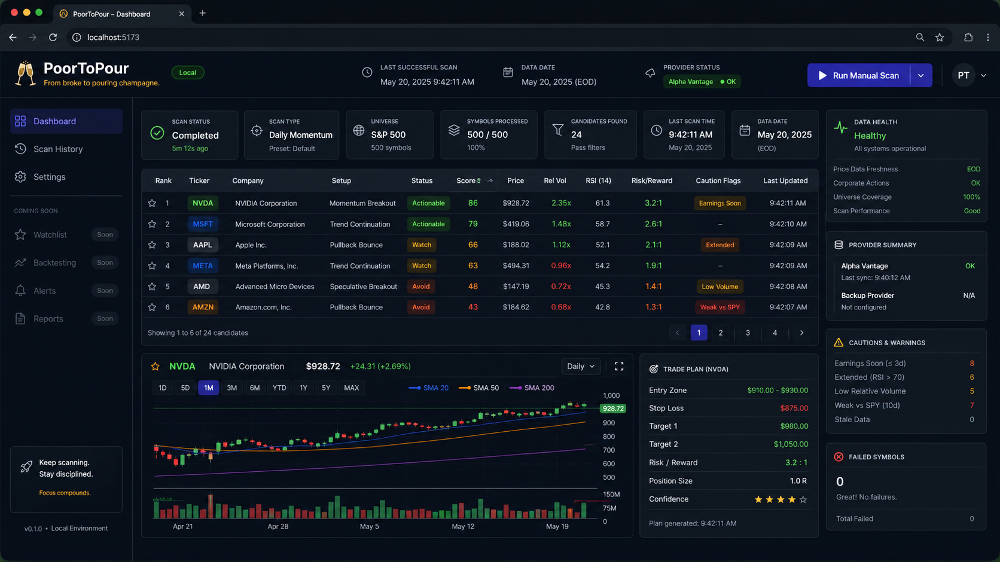
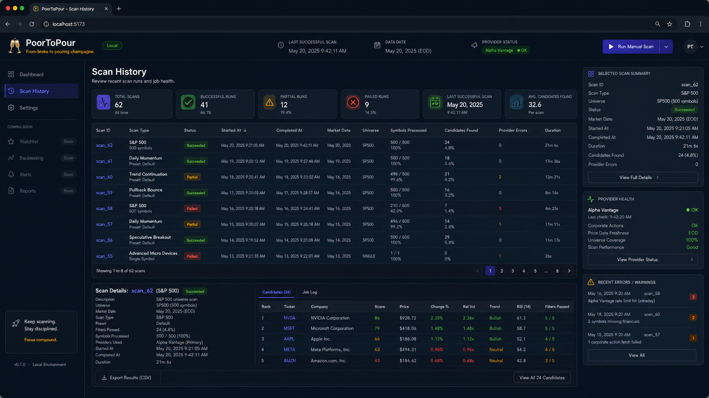
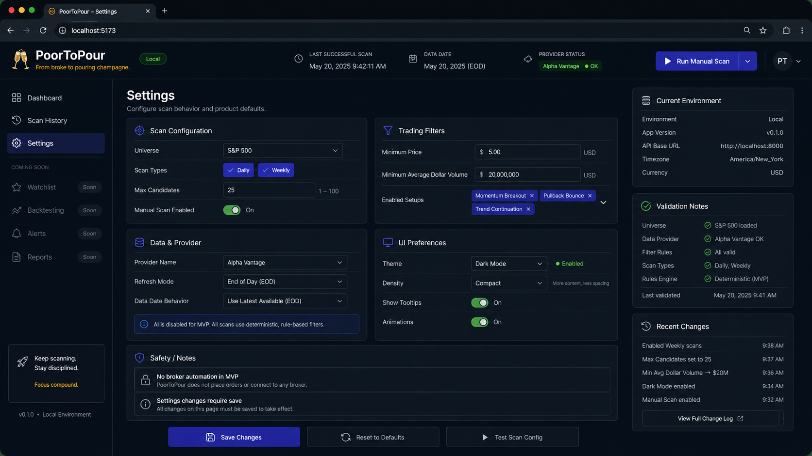

# PoorToPour 🥂📈

From broke to pouring champagne.

PoorToPour is a personal trading research dashboard for scanning U.S. equities, identifying explainable technical trade setups, and reviewing candidate trade ideas with chart evidence, score breakdowns, caution flags, and risk/reward context.

The long-term vision is to grow this into a controlled trading assistant, but the MVP is intentionally simple: a local-first, long-only swing-trade scanner for the S&P 500 using daily and weekly data.

## Current Status

**Phase:** Phase 1 — Data Foundation  
**MVP Direction:** Local-first research dashboard  
**Trading Scope:** Long-only, daily/weekly swing scans  
**Universe:** S&P 500 first  
**Execution:** Manual review only  
**Automation:** Not included in MVP

## MVP Scope

The MVP should allow the user to:

- load a defined U.S. stock universe;
- ingest daily OHLCV data;
- compute technical indicators;
- detect basic long-only setups;
- rank candidates;
- inspect chart evidence;
- review setup explanations;
- see caution flags and data freshness;
- view basic risk/reward estimates;
- review previous scan runs.

## Not MVP

PoorToPour does not include these in the MVP:

- live broker trading;
- automatic order placement;
- options trading;
- short-selling;
- intraday day-trading scans;
- AI-generated trade decisions;
- social-media/news firehose ingestion;
- multi-user SaaS features.

## First Setup Families

The first scanner focuses on:

1. Breakout
2. Pullback continuation
3. Relative strength leader

All strategy output should be deterministic, explainable, and suitable for future backtesting.

## Planned Stack

| Layer | Direction |
| --- | --- |
| Frontend | React + TypeScript |
| Backend | Python FastAPI |
| Database | PostgreSQL |
| Local runtime | Docker Compose |
| Scheduling | APScheduler first |
| Indicators | Internal `IndicatorService`, with open-source libraries where practical |
| Data | Tier 1 provider-backed data for MVP |

## UI Direction

The MVP dashboard should feel like a compact dark-mode trading research cockpit: scan status, ranked candidates, chart evidence, risk/reward context, and data-health visibility all in one focused workflow.

These mockups are visual references, not strict pixel-perfect implementation specs.

### Dashboard Home

### Scan History

### Settings

### Run Manual Scan

## Project Documentation

| Document | Purpose |
| --- | --- |
| [`docs/00-project-plan.md`](docs/00-project-plan.md) | Project vision, MVP boundary, and roadmap |
| [`docs/01-product-requirements.md`](docs/01-product-requirements.md) | Product workflows and MVP behavior |
| [`docs/02-trading-strategy-requirements.md`](docs/02-trading-strategy-requirements.md) | Strategy rules, indicators, scoring, and setup logic |
| [`docs/02a-trading-concepts-glossary.md`](docs/02a-trading-concepts-glossary.md) | Trading concept explanations |
| [`docs/03-technical-architecture.md`](docs/03-technical-architecture.md) | System architecture, modules, APIs, and data flow |
| [`docs/04-data-sources.md`](docs/04-data-sources.md) | Data-source strategy, provider tiers, and freshness rules |
| [`docs/05-dashboard-design.md`](docs/05-dashboard-design.md) | Dashboard screens, UI flow, and visual requirements |
| [`docs/06-risk-and-backtesting.md`](docs/06-risk-and-backtesting.md) | Risk model, backtesting, paper-trading gates, and automation safety |
| [`docs/07-cost-and-operations.md`](docs/07-cost-and-operations.md) | Cost targets, hosting modes, AI budget controls, and operations |
| [`docs/08-execution-tracker.md`](docs/08-execution-tracker.md) | Current phase, active tasks, risks, and next steps |
| [`docs/09-decision-log.md`](docs/09-decision-log.md) | Accepted decisions and trade-offs |
| [`docs/10-ai-working-guidelines.md`](docs/10-ai-working-guidelines.md) | AI collaboration workflow and engineering standards |

## Safety Principles

PoorToPour is research-first.

- Scanner output is not financial advice.
- Risk/reward values are research estimates.
- `Actionable` means worth manual review, not automatic buy.
- Missing or stale required price data should block candidates.
- Broker automation requires backtesting, paper trading, risk limits, audit logs, and a kill switch.

## Data Strategy

MVP uses **Tier 1 provider-backed data only** for core scanner inputs.

Tier 2 official public APIs and Tier 3 scraping are deferred to MVP+ or later, after the MVP scanner proves useful.

## Cost Philosophy

PoorToPour should be cheap by default and scalable by choice.

The MVP should run locally first and avoid expensive always-on AI agents, premium data feeds, and complex cloud infrastructure until the scanner demonstrates value.

## Disclaimer

This project is for personal research and education. It does not provide financial advice, investment recommendations, or trading instructions.